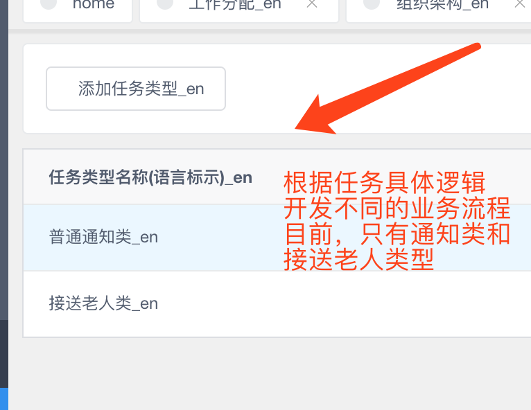
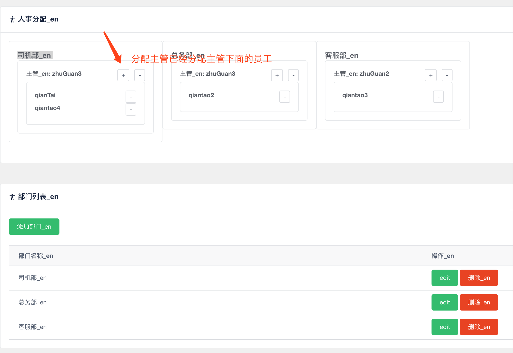

## 老人院项目管理后台使用简介

### 账户密码
- #### 超级管理员
  > * userName：`admin`
  > * passWord: `123456`
- #### 测试员工账号(web管理后台)

> ###### 主管1(总务部，司机部)
> * userName：`zhuGuan3`
> * passWord: `888888`

> ###### 主管2(客服部)
> * userName：`zhuGuan2`
> * passWord: `888888`

> ###### 前台员工
> * userName：`qianTai`
> * passWord: `888888`

### &nbsp;
*注：因为测试会切换多个账户，所以正确测试的方法 ，请关闭网页，从新打开*

### &nbsp;

### 后台功能
- #### 组织架构->组织架构
### &nbsp;
### &nbsp;

## &nbsp;

